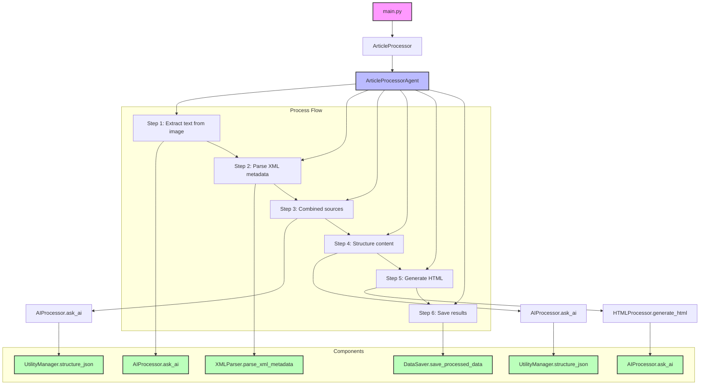

# Python Starter

[](https://github.com/astral-sh/uv)
[](https://pypi.python.org/pypi/uv)
[](https://microsoft.github.io/pyright/)
[](https://github.com/rjoydip/genai-article-processor/actions/workflows/ci.yml)

Building an Application for Processing Old Article Images with AI.

## 🚀 Features

- Docker support
- UV package manager
- Ruff for code formatting and linting
- Pytest for testing

## 📋 Prerequisites

- Python 3.13+
- Docker Desktop
- UV package manager

## Codeflow



## 🛠 Installation

1. Clone the repository:

-----

Install project dependencies:

```bash
uv sync
```

## Development

### Local Development

- Run UV application locally:

```bash
uv run main.py -n <INPUT_FILENAME>
# or
uv run main.py --name <INPUT_FILENAME>
```

- Run code formatting and linting:

```bash
uv run ruff format .
# or
uv run ruff check --fix
```

- Run typechecking:

```bash
uv run pyright
```

- Run tests:

```bash
uv run pytest
```

### Docker Development

Build and run the application in Docker:

```bash
docker build -t app .
docker run -p 8000:8000 app
```

## ⚙️ Configuration

- Project dependencies and settings are managed in `pyproject.toml`
- Ruff is configured for code formatting and linting
- Pytest is set up for testing

## 🧪 Testing

Tests are located in the `tests/` directory. Run the test suite using:

```bash
uv run pytest
```

## 🔍 Project Structure

```txt
uv-ci-template/
|── main.py # UV application
├── tests/
│ └── tests.py # Test suite
├── Dockerfile # Docker configuration
├── pyproject.toml # Project configuration
├── uv.lock # Libs and dependencies
└── README.md
```

## 👥 Contributing

1. Fork the repository
2. Create your feature branch (`git checkout -b feature/amazing-feature`)
3. Commit your changes (`git commit -m 'Add some amazing feature'`)
4. Push to the branch (`git push origin feature/amazing-feature`)
5. Open a Pull Request
